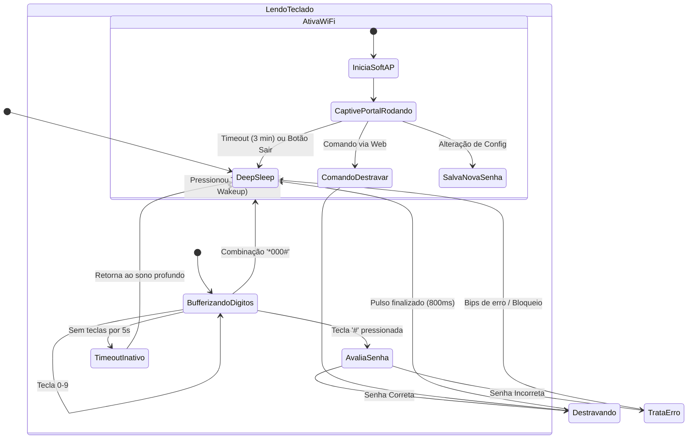
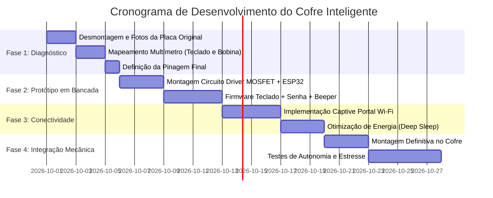

# RDC - Requisitos e Diretrizes de Concepção
## Projeto: Retrofit Inteligente de Cofre Eletrônico com ESP32-C3

---

| **Documento** | Requisitos e Diretrizes de Concepção (RDC) |
| :--- | :--- |
| **Projeto** | Cofre Eletrônico Inteligente (Retrofit) |
| **Autor** | Fernando Polito |
| **Microcontrolador** | ESP32-C3FH4 (Placa ESP32-C3 Pro Mini / Super Mini) |
| **Status** | Versão 1.0 - Concepção Inicial |
| **Data** | Setembro de 2026 |

---

## 1. Contexto e Justificativa

O cofre eletrônico em questão possui mecanismo mecânico de travamento acionado por solenoide (bobina eletromecânica) acoplado a um teclado numérico e placa eletrônica original alimentada por bateria de 9V. Por perda da senha mestre/usuário e obsolescência/descontinuação do fabricante original, o cofre encontra-se inoperante.

O objetivo do projeto é realizar um **retrofit completo da eletrônica de controle**, aproveitando o invólucro do teclado, a furação e o atuador eletromecânico (bobina), substituindo o microcontrolador original obsoleto por um **ESP32-C3FH4 Pro Mini**.

O novo sistema deve fornecer:
1. **Operação Primária Local:** Abertura simples e rápida via teclado numérico físico com feedback sonoro e luminoso.
2. **Interface de Gestão e Emergência via Wi-Fi:** Captive Portal acessível diretamente pelo smartphone (sem necessidade de instalar nenhum aplicativo ou app proprietário).
3. **Eficiência Energética Crítica:** Capacidade de operar com bateria por longos períodos através de estratégias agressivas de *Deep Sleep* e acionamento de rádio Wi-Fi sob demanda.
4. **Segurança Lógica e Física:** Algoritmos anti-força bruta, criptografia/hashing de credenciais e proteção contra queima de bobina.

---

## 2. Levantamento do Sistema Original e Engenharia Reversa

Antes de ligar o novo microcontrolador, é mandatório realizar um protocolo de engenharia reversa na placa e chicote existentes:

```
[ Bateria 9V / Externa ]
          │
          ├───► [ Regulador de Tensão ] ───► VCC Lógica (5V / 3.3V)
          │
          └───► [ Driver de Potência (Transistor/MOSFET) ] ───► [ Bobina Solenoide ]
                         ▲
                         │ (Sinal de Disparo)
          [ Teclado Matricial / Divisor ] ───► [ Microcontrolador Original ]
```

### 2.1. Identificação do Teclado
Existem dois padrões construtivos comuns em placas de teclado de cofres residenciais/comerciais:
1. **Matriz Digital (Ex: 3x4 colunas/linhas):** Requer de 7 a 8 vias digitais. No ESP32-C3 (que possui GPIOs limitadas), pode ser lido via GPIOs diretas se disponíveis, ou via multiplexador/expansor se as portas forem escassas.
2. **Escada de Resistores Analógica (Resistor Ladder):** Muito comum por economia de pinos. Cada tecla aciona um divisor de tensão resistivo lido por um único pino analógico (ADC).
3. **Chaves Táteis Diretas:** Linha comum (GND) e 1 via por botão (geralmente associado a encoders ou shift registers).

> **Ação de Diagnóstico:** Testar a continuidade e variação de resistência/tensão no conector do teclado ao pressionar as teclas de 0 a 9, `*` e `#`.

### 2.2. Circuito da Bobina de Destravamento (Solenoide)
* A bobina opera tipicamente em **9V DC** (tensão nominal da bateria) ou **5V DC**.
* **Consumo de corrente:** Durante o pulso, solenoides de cofre drenam entre **0.8A e 2.0A**.
* **Proteção Indutiva Obrigatória:** Verificar a presença de **diodo flyback (roda-livre)** em antiparalelo com a bobina (ex: 1N4007, SS14, SS34). Se não houver na placa original, é mandatório adicionar para não queimar o estágio de potência e o ESP32 com o pico de tensão reversa ($V = -L \frac{di}{dt}$).
* **Driver:** Identificar se o chaveamento original é feito por transistor NPN Darlington (ex: TIP120, BD681) ou MOSFET canal N (ex: AO3400, IRLML2502, IRFZ44N). Se o driver original estiver intacto, basta injetar o sinal de controle do ESP32 no terminal de base/gate.

### 2.3. LEDs e Buzzer
* Mapear os LEDs de status (geralmente Verde = Sucesso/Aberto, Vermelho = Erro/Bloqueado, Amarelo = Modo Programação/Bateria Fraca).
* Mapear o Buzzer (identificar se é ativo — basta nível lógico HIGH para apitar — ou passivo — requer sinal PWM de ~2kHz a 4kHz para soar tom).

---

## 3. Especificação do Hardware Novo (ESP32-C3)

### 3.1. O Módulo ESP32-C3FH4 Pro Mini / Super Mini
* **Processador:** RISC-V 32-bit Single-Core operando em até 160 MHz.
* **Memória:** 400 KB SRAM, 4 MB Flash integrada (SIP).
* **Conectividade:** Wi-Fi 802.11 b/g/n (2.4 GHz) e Bluetooth 5.0 (LE).
* **Form-Factor:** Extremamente reduzido (~22.5 x 18 mm), perfeito para caber no compartimento da tampa do teclado ou alojamento interno.
* **Portas GPIO:** GPIO 0 a GPIO 10, GPIO 20 (RX), GPIO 21 (TX).

```
                      ┌──────────────────────┐
                      │   ESP32-C3 SuperMini │
             3V3  ─── │ [3V3]          [5V]  │ ─── VIN (5V Regulado)
             GND  ─── │ [GND]         [GND]  │ ─── GND
    (ADC1_CH0) 0  ─── │ [IO0]         [IO1]  │ ─── 1 (ADC1_CH1)
    (ADC1_CH2) 2  ─── │ [IO2]         [IO3]  │ ─── 3 (ADC1_CH3)
    (ADC1_CH4) 4  ─── │ [IO4]         [IO5]  │ ─── 5
               6  ─── │ [IO6]         [IO7]  │ ─── 7
               8  ─── │ [IO8]         [IO9]  │ ─── 9 (Boot)
              10  ─── │ [IO10]       [IO20]  │ ─── 20 (U0RX)
                      │       [IO21]         │ ─── 21 (U0TX)
                      └──────────────────────┘
```

---

## 4. Requisitos do Sistema

### 4.1. Requisitos Funcionais (RF)

* **RF01 - Abertura por Senha Numérica (Individualizada):** O sistema deve permitir destravar o cofre digitando uma sequência configurável de 4 a 8 dígitos seguida de `#`. Cada usuário cadastrado possui seu próprio PIN numérico.
* **RF02 - Feedback Audiovisual:**
  * Bip curto a cada tecla pressionada.
  * Bip duplo e LED verde para senha correta + retração da bobina.
  * Bip longo (3 bips) e LED vermelho para senha incorreta.
* **RF03 - Temporização da Bobina:** O acionamento da bobina deve ser estritamente temporizado por pulso único (ex: 800 ms a 1200 ms), cortando a energia logo em seguida para preservar a bateria e o enrolamento.
* **RF04 - Modo Wi-Fi Captive Portal Sob Demanda:**
  * Para economizar bateria, o Wi-Fi **permanece desligado** por padrão.
  * O Wi-Fi só será ativado quando uma combinação especial for digitada no teclado (ex: `*000#` ou segurar `*` por 3 segundos).
  * Ao ativar, o ESP32 entra em modo SoftAP gerando uma rede Wi-Fi própria (`Cofre-Smart-Setup`).
  * Qualquer celular conectado é direcionado automaticamente para a página de gestão (Captive Portal DNS).
* **RF05 - Autenticação Obrigatória no Captive Portal (Sem Abertura Aberta):**
  * O botão de destravamento no portal Web **exige autenticação por PIN**. Nenhum usuário anônimo ou dispositivo que apenas conectou no Wi-Fi poderá acionar a bobina sem digitar um PIN cadastrado.
  * O sistema identifica qual usuário autenticou e autorizou o destravamento.
* **RF06 - Gestão de Múltiplos Usuários (Mestre e Usuários):**
  * **Usuário Mestre (Admin):** Permissão total para abrir, cadastrar novos usuários, remover usuários, alterar tempos de pulso e visualizar o histórico completo.
  * **Usuários Padrão:** Cada um possui nome amigável (ex: "Carlos", "Família") e PIN próprio de 4 a 8 dígitos. Aberturas pelo teclado físico ou Web identificam exatamente quem abriu.
* **RF07 - Log de Auditoria Personalizado:**
  * Registro detalhado em memória não-volátil (NVS) das últimas aberturas e tentativas.
  * Informações registradas: Data/Hora, Usuário Identificado, Canal de Acesso (Teclado Físico ou Portal Web), Ação e Status (Sucesso/Falha).
* **RF08 - Timeout de Inatividade Wi-Fi:** Se nenhuma ação for tomada na interface Web em até 3 minutos, o rádio Wi-Fi desliga automaticamente e o ESP32 retorna ao modo Deep Sleep.
* **RF09 - Bloqueio Anti-Força Bruta:**
  * 3 tentativas consecutivas de senha incorreta geram bloqueio temporário de 1 minuto.
  * 5 tentativas incorretas geram bloqueio de 5 minutos com bips de alarme.
* **RF10 - Botão Físico de Reset/Programação Interno:** Microswitch localizado no interior do cofre para restauração da senha de fábrica caso a Senha Mestre seja esquecida (disponível somente com o cofre fisicamente aberto).
* **RF11 - Mecanismo de Resgate por Chave de Hardware (Zero-Knowledge MAC Token):**
  * Para o cenário crítico de perda total da Senha Mestre com o cofre **fechado e trancado**, o sistema implementa um algoritmo determinístico que calcula uma **Chave Mestre de Resgate de 6 dígitos** baseada no endereço MAC físico de fábrica do ESP32 combinado com um salt criptográfico privado (`SHA-256 / Seed`).
  * **Blindagem do Captive Portal (Zero-Knowledge):** O Portal Web e as APIs REST do ESP32 **NUNCA exibem nem transmitem a Chave de Resgate na rede**, impedindo que qualquer pessoa que se conecte ao Wi-Fi descubra o código.
  * O proprietário gera sua chave offline em seu computador utilizando o script seguro (`tools/gerar_chave_resgate.py`) e a guarda fisicamente fora do cofre.
  * O portal e o teclado físico apenas aceitam a chave para autenticação e destravamento de emergência, registrando o evento no log de auditoria permanente (`🚨 DESTRAVAMENTO DE EMERGÊNCIA POR CHAVE MAC`).

---

### 4.2. Requisitos Não-Funcionais (RNF)

* **RNF01 - Gerenciamento Térmico e de Energia (Crítico):**
  * O consumo em repouso (Deep Sleep) não deve ultrapassar **25 µA** (ou < 1 mA considerando o regulador de tensão), garantindo autonomia mínima de meses na bateria.
  * O microcontrolador deve acordar instantaneamente (< 50 ms) ao pressionar qualquer tecla através de interrupção externa (Wakeup por GPIO).
* **RNF02 - Persistência Segura:** As senhas e configurações devem ser salvas na memória não-volátil (NVS/LittleFS). Senhas devem ser armazenadas com hash criptográfico (ex: SHA-256 + Salt).
* **RNF03 - Segurança do Mecanismo (Fail-Secure):** Em caso de queda de energia ou esgotamento total da bateria, a bobina deve permanecer em repouso mecânico (travada).
* **RNF04 - Usabilidade Sem App:** A configuração de emergência/gestão deve funcionar 100% via navegador Web padrão (iOS/Android) sem download na App Store ou Play Store.

---

## 5. Diretrizes de Alimentação e Gerenciamento de Energia

### 5.1. O Problema da Bateria de 9V (6LR61)
Uma bateria alcalina comum de 9V possui capacidade de apenas ~550 mAh e alta resistência interna. Se o rádio Wi-Fi do ESP32 (~120 mA a 240 mA em pico de TX) ficasse ligado direto:
$$\text{Autonomia estimada com Wi-Fi ativo} = \frac{550\text{ mAh}}{120\text{ mA}} \approx 4.5\text{ horas!}$$

Por outro lado, adotando a estratégia **Deep Sleep**:
* Consumo em repouso: $\sim 15\ \mu\text{A}$
* Tempo de operação por digitação: $\sim 2\text{ segundos}$ a cada abertura ($\sim 25\text{ mA}$ de consumo do core).
* Pulso do solenoide: $\sim 800\text{ ms}$ a $1\text{ A}$.
* Autonomia estimada: **1 a 2 anos** em uso residencial normal!

```
                  ┌──────────────────────────────────────────────┐
                  │               CICLO DE ENERGIA               │
                  └──────────────────────────────────────────────┘
                                         │
                                         ▼
                               ┌───────────────────┐
                               │    DEEP SLEEP     │◄──────┐
                               │   (15µA - 50µA)   │       │
                               └───────────────────┘       │
                                         │                 │
                               Tecla pressionada           │
                               (GPIO Wake-up)              │
                                         ▼                 │
                               ┌───────────────────┐       │
                               │  LEITURA TECLADO  │       │
                               │   (20mA - 30mA)   │       │
                               └───────────────────┘       │
                                  │             │          │
                     Senha Correta│             │ Timeout  │
                                  ▼             │ ou Erro  │
                        ┌───────────────────┐   │          │
                        │ DISPARO DA BOBINA │   │          │
                        │  (Pulso de 800ms) │   │          │
                        └───────────────────┘   │          │
                                  │             │          │
                                  └─────────────┴──────────┘
```

### 5.2. Alternativas de Alimentação
1. **Bateria 9V Original:** Mantida para retrocompatibilidade física.
2. **Pack de 4 Pilhas AA (6V) ou 2x Baterias 18650 Li-Ion (7.4V - 8.4V):** Oferecem capacidade superior (2500 mAh - 3000 mAh) e excelente capacidade de corrente para o solenoide.
3. **Ponto de Alimentação de Emergência Externo:** Manter os dois contatos metálicos frontais originais (ou instalar um conector USB-C fêmea discreto na moldura externa) para alimentar o cofre caso a bateria interna se esgote com a porta trancada.

---

## 6. Arquitetura de Software e Firmware

### 6.1. Diagrama da Máquina de Estados (FSM)



### 6.2. Estratégia de Captive Portal
1. **SoftAP:** O ESP32 sobe uma rede sem fio aberta ou com senha simples (ex: SSID: `Cofre-Smart-XXXX`, IP: `192.168.4.1`).
2. **DNSServer:** Intercepta todas as requisições de domínio (porta 53) e responde com `192.168.4.1`. Isso faz com que smartphones Android e iOS exibam a notificação instantânea: *"Fazer login na rede Wi-Fi"*.
3. **WebServer Assíncrono (Web UI):**
   * HTML5 + CSS moderno responsivo embutido em memória Flash (GZIP).
   * Requisições AJAX/Fetch para endpoints REST:
     * `POST /api/unlock` -> Aciona destravamento imediato.
     * `POST /api/password` -> Atualiza senha com validação de senha atual.
     * `GET /api/status` -> Tensão da bateria, tempo de atividade e versão de firmware.
     * `POST /api/sleep` -> Força desligamento imediato do rádio e entrada em deep sleep.

---

## 7. Mapeamento Preliminar de GPIOs (ESP32-C3)

| Função | Pino ESP32-C3 | Tipo | Observações |
| :--- | :--- | :--- | :--- |
| **Driver da Bobina (Gate MOSFET)** | `GPIO 3` | Saída Digital | Com resistor pulldown de 10kΩ externo para garantir 0V no boot. |
| **Buzzer** | `GPIO 4` | Saída (LEDC/PWM) | Controle de frequência para bips curtos/longos. |
| **LED Verde (Status Aberto)** | `GPIO 5` | Saída Digital | Resistor limitador 330Ω. |
| **LED Vermelho (Erro/Alerta)** | `GPIO 6` | Saída Digital | Resistor limitador 330Ω. |
| **Teclado (Entrada Analógica)** | `GPIO 0` (ADC1_CH0) | Entrada Analógica | Caso o teclado original utilize escada resistiva (resistor ladder). |
| **Wakeup Teclado / Linha Interrupção** | `GPIO 1` | Entrada c/ Interrupção | Pino com suporte a Wakeup em Deep Sleep. |
| **Botão de Programação Interno** | `GPIO 2` | Entrada Digital | Chave tátil interna para reset de fábrica. |
| **Monitoramento de Bateria** | `GPIO 7` (ADC1_CH7) | Entrada Analógica | Divisor resistivo (ex: 100kΩ / 33kΩ) para medir a tensão de 9V. |

*(Nota: Caso o teclado original seja uma matriz digital pura de 7 vias, os pinos GPIO 0, 1, 2, 7, 8, 9, 10 poderão ser alocados para a matriz, ou utilizado um shift-register / expansor I2C).*

---

## 8. Fases de Execução do Projeto



1. **Fase 1 - Engenharia Reversa:** Teste de bancada da placa original, identificação de trilhas e levantamento esquemático do driver da bobina e pinagem do teclado.
2. **Fase 2 - Prova de Conceito (PoC) do Hardware:** Montagem do ESP32-C3 com o driver do solenoide e teclado em protoboard.
3. **Fase 3 - Firmware Principal:** Desenvolvimento da lógica de leitura do teclado, FSM de controle da bobina e máquina de estados anti-brute-force.
4. **Fase 4 - Captive Portal & Gestão:** Criação da interface Web responsiva e servidor DNS captive.
5. **Fase 5 - Eficiência Energética:** Implementação e medição do Deep Sleep com despertar por interrupção.
6. **Fase 6 - Montagem Final e Validação:** Instalação física no cofre e testes de campo.
